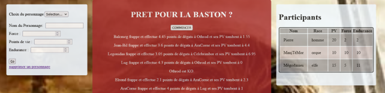
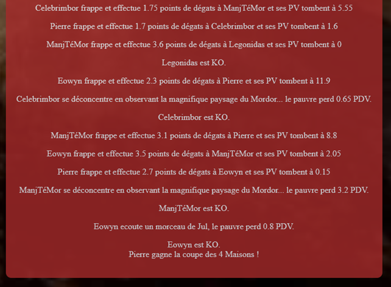

# Battle royal - Seigneur des anneaux

## l'exercice
Cet exercice était une évaluation sur la programmation orientée objet que nous venions de découvrir. Le but était de créer un jeu avec deux Personnages (objets) ayants des caractéristiques et les faisant se battre jusqu’à la victoire de l’un d’eux. Dans mon cas, j’ai plutôt créé une arène avec autant de Personnages possibles en mode « battle royal », c’est-à-dire qu’ils se battent tous les uns contre les autres en même temps, ou plustot, l'un après l'autre.

## Création
J’ai créé une page principale qui gère le combat, sur cette page il y a 3 actions possibles :
-	Créer un personnage avec un formulaire (nom, race, force, pdv, endurance), personnage qui sera enregistré en base de données puis affiché dans un tableau de participants.
-	Supprimer un personnage existant (visible depuis le tableau des participants)
-	Lancer le combat avec les personnages existants + les personnages de base qui sont toujours dans l'arène au debut du combat.

### exemple 

